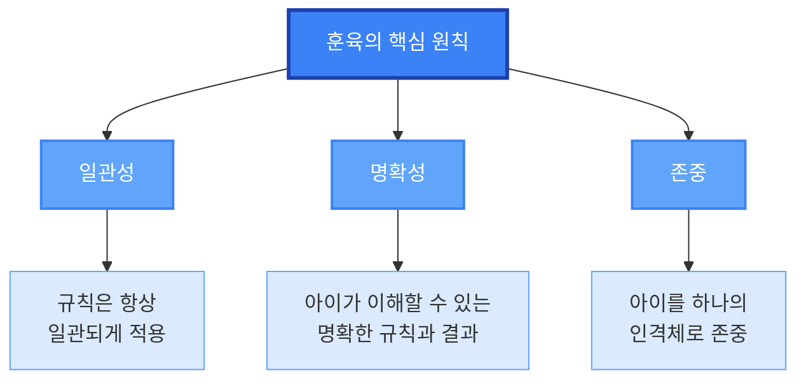

# 훈육의 기본 원칙

## 훈육이란?

- **훈육**은 아이에게 올바른 행동을 가르치는 과정입니다
- 단순한 처벌이 아닌 **교육**의 일환입니다
- 아이의 자존감을 해치지 않으면서 행동을 개선하는 것이 목표입니다

## 핵심 원칙

| 원칙 | 설명 |
|------|------|
| **일관성** | 규칙은 항상 일관되게 적용되어야 합니다 |
| **명확성** | 아이가 이해할 수 있는 명확한 규칙과 결과를 제시합니다 |
| **존중** | 아이를 하나의 인격체로 존중하며 대화합니다 |

---

# 효과적인 훈육 방법

## 긍정적 강화

- 좋은 행동을 했을 때 **즉시 칭찬**합니다
- 구체적으로 어떤 행동이 좋았는지 설명합니다
  - "장난감을 정리해줘서 고마워"
  - "친구에게 양보해준 모습이 정말 멋졌어"

## 자연스러운 결과

- 행동의 자연스러운 결과를 경험하게 합니다
- 예: 밥을 안 먹으면 배가 고프다는 것을 자연스럽게 학습

## 타임아웃 활용

- 감정이 격해졌을 때 잠시 휴식을 취합니다
- 아이의 나이만큼의 분수만큼 시간을 둡니다 (3세 = 3분)

---

# 실전 팁과 주의사항

## 실전 팁

1. **예방이 최선**: 문제가 생기기 전에 환경을 조성합니다
2. **감정 조절**: 부모의 감정이 격해지면 잠시 멈춥니다
3. **대안 제시**: "하지 마"보다 "이렇게 해보자"를 제시합니다

---

# 나이별 훈육 방법

## 유아기 (1-3세)

- **단순하고 명확한 규칙** 제시
- **즉각적인 피드백** 제공
- **안전**이 최우선

## 유치원기 (4-6세)

- **이유 설명**과 함께 규칙 제시
- **선택권** 부여로 자율성 키우기
- **긍정적 강화** 중심

## 초등학생 (7-12세)

- **논리적 설명**과 **대화** 중심
- **책임감** 부여
- **자연스러운 결과** 경험

---

# 훈육 시나리오 예시

## 시나리오 1: 장난감 정리 안 함

**잘못된 방법:**
- "빨리 정리 안 하면 버린다!" (위협)

**올바른 방법:**
- "장난감을 정리하면 다음에 더 쉽게 찾을 수 있어요"
- 자연스러운 결과: 정리 안 하면 장난감을 찾기 어려움

## 시나리오 2: 친구와 싸움

**잘못된 방법:**
- "너 때문에 친구가 울었어!" (비난)

**올바른 방법:**
- "친구가 어떤 기분이었을까요?"
- 감정 공감과 대안 제시

---

# 주의사항

## 피해야 할 행동

| ❌ 피해야 할 것 | 이유 |
|----------------|------|
| **화를 내며 소리치기** | 아이는 두려워할 뿐 배우지 못합니다 |
| **과도한 처벌** | 아이의 자존감을 해칩니다 |
| **일관성 없는 규칙** | 아이가 혼란스러워합니다 |
| **감정적 반응** | 아이는 부모의 감정을 모방합니다 |

---

# 마무리 및 요약

## 핵심 메시지

> 훈육의 목표는 **순종**이 아니라 **이해**입니다.
> 아이가 왜 그 행동이 잘못되었는지 이해하도록 도와주세요.

## 기억할 3가지

1. **일관성** - 규칙은 항상 일관되게
2. **명확성** - 아이가 이해할 수 있게
3. **존중** - 아이를 인격체로 존중

## 마지막 조언

훈육은 **단기간의 승리**가 아닌 **장기적인 성장**을 위한 투자입니다.
인내심을 가지고 아이와 함께 성장해 나가세요.

---
